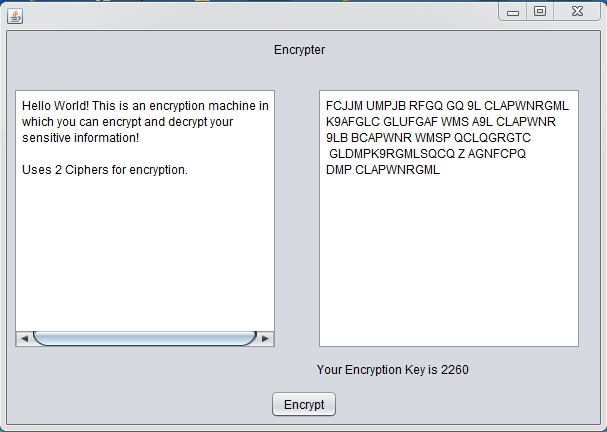
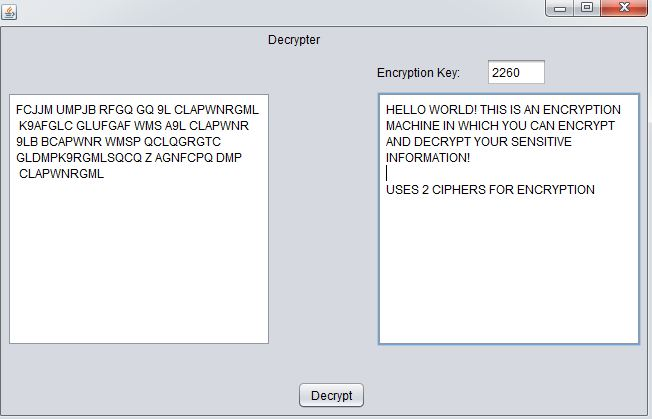

# Encryption-Machine
This Uses Ciphers to encrypt alphanumeric data. A unique 4-digit encryption key is generated which is to be preserved in order to decrypt the data.
## Encrypter
User needs to enter Text in the field provided and press encrypt!

This leads to generation of a unique encryption Key!

## Decrypter
The user then needs to enter the encrypted gibberish and the encryption key, in order to retrive the original data!

Made With Love Using Java Swings!
Feel free to clone it and import it into netbeans/eclipse to store some really secret information in a really stealthy way!
